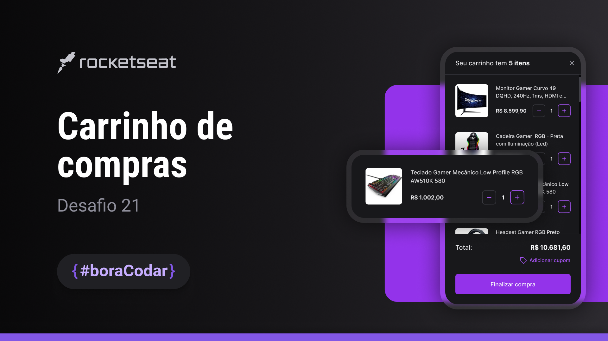

  

## 🛒 Projeto </>

É um projeto de um carrinho de compras, podendo ser usado em aplicações web e mobile.

## ⚙ Tecnologias </> 
Esse projeto foi desenvolvido durante o desadio do #boraodar #21 da Rocktseat com as seguintes tecnologias:
- HTML
- CSS
- Git e Github

## 🖌️ Layout </>

Você pode visualizar o layout do projeto através
[desse link](https://www.figma.com/file/vIOi6xkSSKnGVDKz6ilcBv/Carrinho-de-compras-%E2%80%A2-Desafio-21-(Community)?type=design&node-id=301%3A129&t=qLUT1nkKOOZwhZ0B-1).
É necessário uma conta [Figma](https://www.figma.com)